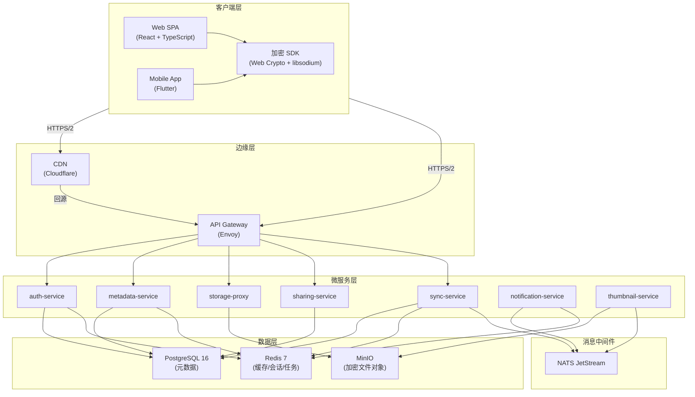

# 功能设计：云存储产品

## 概述

本文档定义类 MEGA 云存储产品的详细功能设计，包括系统架构、模块划分、API 设计、数据库设计、加密流程、文件传输协议及冲突解决策略。

---

## 1. 系统架构

### 1.1 整体架构图



### 1.2 微服务通信矩阵

| 调用方 ↓ / 被调方 → | auth | metadata | storage-proxy | sharing | sync | notification |
|----------------------|------|----------|--------------|---------|------|--------------|
| **API Gateway** | ✓ | ✓ | ✓ | ✓ | ✓ | - |
| **auth-service** | - | - | - | - | - | NATS |
| **metadata-service** | - | - | ✓ (跨服调用) | - | NATS | NATS |
| **storage-proxy** | - | ✓ (验证权限) | - | - | - | - |
| **sharing-service** | - | ✓ (查询元数据) | - | - | - | NATS |
| **sync-service** | - | ✓ (拉取变更) | - | - | - | NATS |

---

## 2. 核心流程设计

### 2.1 用户注册流程

```
客户端                                    服务端
  │                                         │
  ├─ 1. 输入邮箱+密码                        │
  ├─ 2. Argon2id(password, salt) → derived   │
  ├─ 3. 生成 X25519 密钥对 (主密钥)           │
  ├─ 4. 生成认证密钥 = derived[0:128]         │
  ├─ 5. 主密钥加密密钥 = derived[128:256]     │
  ├─ 6. 主密钥私钥用主密钥加密密钥 AES-GCM    │
  ├─ 7. POST /auth/register ────────────────→│
  │    body: {                               │
  │      email,                              │
  │      auth_key_hash: SHA-256(认证密钥),    │
  │      master_pubkey,                      │
  │      encrypted_master_privkey,           │
  │      kdf_salt, kdf_params                │
  │    }                                     │
  │                                          ├─ 8. 存储 bcrypt(auth_key_hash)
  │                                          ├─ 9. 存储加密的主密钥私钥
  │                                          ├─ 10. 发送验证邮件
  │  11. 收到 201 Created ←──────────────────┤
  │                                          │
  │  12. 用户点击邮件验证链接 → 账户激活       │
```

### 2.2 文件上传流程

```
客户端                                    服务端 (storage-proxy)
  │                                         │
  ├─ 1. 生成随机 FileKey (256-bit)           │
  ├─ 2. POST /files/upload/init ────────────→│
  │    body: {                               │
  │      filename_encrypted,                 │
  │      parent_folder_id,                   │
  │      file_size,                          │
  │      chunk_size: 4194304,                │
  │      encrypted_filekey,                  │
  │      file_nonce                          │
  │    }                                     │
  │                                          ├─ 3. 验证JWT，检查配额
  │  4. session_id, chunk_urls ←─────────────┤
  │                                         │
  ├─ 5. 文件分块 (4MB/块)                     │
  ├─ 6. 每块再分 64KB 加密单元                │
  │    对每个 64KB 单元:                       │
  │    - AES-256-GCM(unit, FileKey) → CT+tag │
  │    - SHA-256(CT) → unit_hash             │
  │    - 构建 Merkle Tree                    │
  ├─ 7. PUT /files/upload/chunk/{id} ───────→│ (并行，最多6个)
  │    body: { encrypted_chunk, chunk_index,  │
  │           chunk_hash }                   │
  │                                          ├─ 8. 校验 chunk_hash
  │                                          ├─ 9. 写入 MinIO
  │  10. chunk_ack ←─────────────────────────┤
  │                                         │
  ├─ 11. 所有块上传完成后:                     │
  ├─ 12. POST /files/upload/complete ───────→│
  │     body: { session_id, merkle_root,      │
  │            merkle_tree_structure }       │
  │                                          ├─ 13. 验证 Merkle Root
  │                                          ├─ 14. 写入元数据到 PG
  │                                          ├─ 15. 发送 file.created 事件
  │  16. 完成确认 ←───────────────────────────┤
```

### 2.3 文件下载流程

```
客户端                                    服务端
  │                                         │
  ├─ 1. GET /files/{id}/download/init ──────→│
  │    Range: bytes=0-                        │
  │                                          ├─ 2. 验证权限
  │  3. 文件元数据 + 加密文件密钥 ←─────────────┤
  │     + 块列表 + Merkle 结构                │
  │                                         │
  ├─ 4. 用主密钥私钥解密文件密钥                │
  ├─ 5. GET /files/{id}/chunks?range=... ────→│ (流式请求块)
  │    Range: bytes=0-4194303                │
  │  6. 加密块数据 ←──────────────────────────┤
  ├─ 7. AES-256-GCM 解密 (64KB单元)           │
  ├─ 8. SHA-256 验证每个解密单元               │
  ├─ 9. 验证 Merkle Root                     │
  ├─ 10. 组装并写入本地文件                    │
  │                                         │
  ├─ 11. 循环 5-10 直到所有块下载完成          │
```

### 2.4 同步流程

```
客户端 A (修改文件)                          sync-service
  │                                         │
  ├─ 1. 检测本地文件变更                       │
  ├─ 2. 计算新 Merkle Tree                    │
  ├─ 3. POST /sync/push ────────────────────→│
  │    body: { file_id, new_merkle_root,      │
  │            changed_chunks[],              │
  │            chunk_hashes[] }              │
  │                                          ├─ 4. 比较服务端 Merkle Root
  │                                          ├─ 5. 识别变更块
  │  6. 需要上传的块列表 ←─────────────────────┤
  ├─ 7. 上传变更块                             │
  │                                          ├─ 8. 更新元数据
  │                                          ├─ 9. 通知其他设备
  │                                          │   (NATS event)

客户端 B (接收同步)                          sync-service
  │  10. NATS 推送 file.updated ←────────────┤
  ├─ 11. POST /sync/pull ───────────────────→│
  │     body: { file_id, local_merkle_root } │
  │  12. 差异块列表 ←─────────────────────────┤
  ├─ 13. 下载变更块                            │
  ├─ 14. 本地合并，更新 Merkle Tree            │
  ├─ 15. POST /sync/ack ────────────────────→│
```

---

## 3. API 设计

### 3.1 API 规范

- 协议: RESTful JSON over HTTPS/2
- 认证: `Authorization: Bearer <JWT>`
- 分页: `?cursor=<opaque_token>&limit=50` (游标分页)
- 版本: `X-API-Version: 1`
- 错误格式: `{ "error": { "code": "INVALID_KEY", "message": "..." } }`

### 3.2 核心 API 清单

#### 认证服务 (auth-service)

| 方法 | 路径 | 说明 |
|------|------|------|
| POST | `/api/v1/auth/register` | 注册新用户 |
| POST | `/api/v1/auth/verify-email` | 验证邮箱 |
| POST | `/api/v1/auth/login` | 登录，返回 JWT |
| POST | `/api/v1/auth/refresh` | 刷新 JWT |
| POST | `/api/v1/auth/logout` | 注销当前会话 |
| POST | `/api/v1/auth/password-reset` | 密码重置请求 |
| GET  | `/api/v1/auth/sessions` | 获取活跃会话列表 |
| DELETE | `/api/v1/auth/sessions/{id}` | 注销指定会话 |

#### 文件服务 (metadata-service + storage-proxy)

| 方法 | 路径 | 说明 |
|------|------|------|
| GET  | `/api/v1/files` | 列出文件夹内容 |
| GET  | `/api/v1/files/{id}` | 获取文件/文件夹元数据 |
| POST | `/api/v1/files/upload/init` | 初始化上传会话 |
| PUT  | `/api/v1/files/upload/chunk/{id}` | 上传分块 |
| POST | `/api/v1/files/upload/complete` | 完成上传 |
| GET  | `/api/v1/files/{id}/download/init` | 初始化下载 |
| GET  | `/api/v1/files/{id}/chunks` | 下载加密块 |
| PATCH | `/api/v1/files/{id}` | 更新元数据（重命名/移动） |
| DELETE | `/api/v1/files/{id}` | 移入回收站 |
| DELETE | `/api/v1/files/{id}/permanent` | 永久删除 |
| POST | `/api/v1/files/{id}/restore` | 恢复 |
| POST | `/api/v1/files/{id}/versions` | 创建命名版本 |
| GET  | `/api/v1/files/{id}/versions` | 获取版本列表 |
| POST | `/api/v1/files/{id}/versions/{vid}/restore` | 恢复版本 |

#### 共享服务 (sharing-service)

| 方法 | 路径 | 说明 |
|------|------|------|
| POST | `/api/v1/shares` | 创建共享链接 |
| GET  | `/api/v1/shares` | 列出我的共享 |
| DELETE | `/api/v1/shares/{id}` | 撤销共享 |
| GET  | `/api/v1/shares/{code}/info` | 获取共享信息（无需登录） |
| POST | `/api/v1/shares/{code}/access` | 访问共享文件（密码验证） |

#### 同步服务 (sync-service)

| 方法 | 路径 | 说明 |
|------|------|------|
| POST | `/api/v1/sync/push` | 推送变更 |
| POST | `/api/v1/sync/pull` | 拉取差异 |
| POST | `/api/v1/sync/ack` | 确认同步完成 |
| GET  | `/api/v1/sync/conflicts` | 获取冲突列表 |
| POST | `/api/v1/sync/conflicts/{id}/resolve` | 手动解决冲突 |

#### 用户与配额

| 方法 | 路径 | 说明 |
|------|------|------|
| GET  | `/api/v1/user/quota` | 获取配额使用情况 |
| GET  | `/api/v1/user/profile` | 获取用户信息 |
| PATCH | `/api/v1/user/profile` | 更新用户信息 |
| DELETE | `/api/v1/user/account` | 注销账户 |

---

## 4. 数据库设计

### 4.1 PostgreSQL 核心表

```sql
-- 用户表
CREATE TABLE users (
    id          UUID PRIMARY KEY DEFAULT gen_random_uuid(),
    email       VARCHAR(255) UNIQUE NOT NULL,
    email_verified BOOLEAN DEFAULT FALSE,
    auth_key_hash VARCHAR(128) NOT NULL,  -- bcrypt(SHA-256(auth_key))
    master_pubkey BYTEA NOT NULL,          -- X25519 公钥 (32 bytes)
    encrypted_master_privkey BYTEA,       -- AES-256-GCM 加密的主密钥私钥
    kdf_salt    BYTEA NOT NULL,
    kdf_params  JSONB NOT NULL,            -- {opslimit, memlimit, algorithm}
    storage_max BIGINT DEFAULT 21474836480, -- 20GB free tier
    transfer_max BIGINT DEFAULT 107374182400, -- 100GB/month
    created_at  TIMESTAMPTZ DEFAULT now(),
    updated_at  TIMESTAMPTZ DEFAULT now(),
    deleted_at  TIMESTAMPTZ
);

-- 刷新令牌表
CREATE TABLE refresh_tokens (
    id          UUID PRIMARY KEY DEFAULT gen_random_uuid(),
    user_id     UUID NOT NULL REFERENCES users(id),
    token_hash  VARCHAR(128) UNIQUE NOT NULL,
    device_info JSONB,
    expires_at  TIMESTAMPTZ NOT NULL,
    created_at  TIMESTAMPTZ DEFAULT now()
);

-- 文件/文件夹节点表
CREATE TABLE file_nodes (
    id          UUID PRIMARY KEY DEFAULT gen_random_uuid(),
    user_id     UUID NOT NULL REFERENCES users(id),
    parent_id   UUID REFERENCES file_nodes(id) ON DELETE CASCADE,
    name_enc    BYTEA NOT NULL,             -- 加密文件名
    name_hash   VARCHAR(64) NOT NULL,       -- SHA-256(name_plain) 用于去重检测
    is_folder   BOOLEAN DEFAULT FALSE,
    size        BIGINT DEFAULT 0,           -- 加密后大小
    real_size   BIGINT DEFAULT 0,           -- 原始文件大小
    mime_type   VARCHAR(128),
    encrypted_filekey BYTEA,               -- 用户主密钥加密的文件密钥
    filekey_for_sharing BYTEA,             -- 系统公钥封装的备用副本
    merkle_root BYTEA,
    chunk_count INTEGER,
    status      VARCHAR(20) DEFAULT 'active', -- active/trashed/deleted
    trashed_at  TIMESTAMPTZ,
    created_at  TIMESTAMPTZ DEFAULT now(),
    updated_at  TIMESTAMPTZ DEFAULT now()
);
CREATE INDEX idx_file_nodes_user_parent ON file_nodes(user_id, parent_id);
CREATE INDEX idx_file_nodes_status ON file_nodes(status);

-- 文件块表
CREATE TABLE file_chunks (
    id          UUID PRIMARY KEY DEFAULT gen_random_uuid(),
    file_id     UUID NOT NULL REFERENCES file_nodes(id),
    chunk_index INTEGER NOT NULL,
    chunk_hash  VARCHAR(64) NOT NULL,       -- SHA-256(encrypted_chunk)
    object_key  VARCHAR(256) NOT NULL,      -- MinIO object key
    size        INTEGER NOT NULL,
    encryption_nonce BYTEA NOT NULL,        -- 12 bytes nonce
    created_at  TIMESTAMPTZ DEFAULT now(),
    UNIQUE(file_id, chunk_index)
);

-- 文件版本表
CREATE TABLE file_versions (
    id          UUID PRIMARY KEY DEFAULT gen_random_uuid(),
    file_id     UUID NOT NULL REFERENCES file_nodes(id),
    version_name VARCHAR(128),
    merkle_root BYTEA NOT NULL,
    chunk_count INTEGER,
    encrypted_filekey BYTEA,
    size        BIGINT,
    created_at  TIMESTAMPTZ DEFAULT now()
);

-- 共享链接表
CREATE TABLE shares (
    id          UUID PRIMARY KEY DEFAULT gen_random_uuid(),
    owner_id    UUID NOT NULL REFERENCES users(id),
    file_node_id UUID NOT NULL REFERENCES file_nodes(id),
    code        VARCHAR(64) UNIQUE NOT NULL, -- 公开分享码
    password_hash VARCHAR(128),             -- bcrypt(可选密码)
    expires_at  TIMESTAMPTZ,
    max_downloads INTEGER,
    download_count INTEGER DEFAULT 0,
    is_revoked  BOOLEAN DEFAULT FALSE,
    created_at  TIMESTAMPTZ DEFAULT now()
);

-- 共享接收者密钥表
CREATE TABLE share_recipient_keys (
    id          UUID PRIMARY KEY DEFAULT gen_random_uuid(),
    share_id    UUID NOT NULL REFERENCES shares(id),
    recipient_id UUID NOT NULL REFERENCES users(id),
    wrapped_filekey BYTEA NOT NULL,         -- 用接收者公钥封装的filekey
    created_at  TIMESTAMPTZ DEFAULT now(),
    UNIQUE(share_id, recipient_id)
);

-- 同步状态表
CREATE TABLE sync_state (
    id          UUID PRIMARY KEY DEFAULT gen_random_uuid(),
    user_id     UUID NOT NULL REFERENCES users(id),
    device_id   VARCHAR(128) NOT NULL,
    file_id     UUID NOT NULL REFERENCES file_nodes(id),
    merkle_root BYTEA NOT NULL,
    synced_at   TIMESTAMPTZ DEFAULT now(),
    UNIQUE(user_id, device_id, file_id)
);
```

### 4.2 Redis 数据结构

| Key 模式 | 类型 | 用途 |
|----------|------|------|
| `session:{token_id}` | String(JSON) | JWT 会话信息 |
| `upload:{session_id}` | Hash | 上传会话状态 |
| `upload:{session_id}:chunks` | Bitmap | 已上传块位图 |
| `quota:{user_id}` | Hash | 实时配额计数 |
| `hot_files:{region}` | Sorted Set | 区域热点文件缓存 |
| `share_access:{code}` | Hash | 共享链接访问计数 |
| `sync_lock:{user_id}:{device_id}` | String(TTL) | 同步分布式锁 |
| `rate_limit:{ip}` | String(TTL) | API 限流 |

---

## 5. 加密架构设计

### 5.1 密钥层次

```
用户密码 (Password)
     │
     └─[Argon2id]──→ 派生密钥 (derived_key)
                         │
         ┌───────────────┴───────────────┐
         │                               │
    auth_key (128bit)              encryption_key (128bit)
    (登录认证)                       (加密主密钥私钥)
         │                               │
         ↓                               ↓
    服务端存储                       解密客户端存储的
    bcrypt(auth_key)               encrypted_master_privkey
                                         │
                                         ↓
                                    master_privkey
                                    (X25519 私钥)
                                         │
                              ┌──────────┴──────────┐
                              │                     │
                        FileKey₁ 解密           FileKey₂ 解密
                        (随机 AES-256)          (随机 AES-256)
                              │                     │
                        文件内容解密             文件内容解密
```

### 5.2 共享加密流程

```
文件所有者 A 将文件共享给用户 B:

1. A 获取 B 的公钥 (从服务端查询)
2. A 用 B 的公钥通过 ECDH 生成共享密钥
3. 用共享密钥加密 FileKey → wrapped_filekey_B
4. POST /shares { target_user: B, file_id, wrapped_filekey_B }

服务端存储:
- shares 表中记录共享关系
- share_recipient_keys 表中存储 wrapped_filekey_B

用户 B 接收:
1. B 发现新的共享文件
2. B 获取 wrapped_filekey_B
3. B 用自己的私钥 + A 的公钥通过 ECDH 还原共享密钥
4. 解密 wrapped_filekey_B → FileKey
5. 用 FileKey 解密文件内容
```

---

## 6. 分块上传/下载协议

### 6.1 分块参数

| 参数 | 值 | 说明 |
|------|-----|------|
| CHUNK_SIZE | 4MB (4194304 bytes) | 上传分块大小 |
| ENCRYPTION_UNIT | 64KB (65536 bytes) | AES-GCM 加密单元 |
| MAX_CONCURRENT_CHUNKS | 6 | 最大并行上传块 |
| RETRY_MAX | 3 | 单块最大重试次数 |
| UPLOAD_SESSION_TTL | 24h | 上传会话超时 |

### 6.2 断点续传

```
客户端维护: local_upload_state = {
    session_id,
    file_path,
    total_chunks,
    uploaded_chunks: Set<chunk_index>,
    failed_chunks: Map<chunk_index, retry_count>,
    merkle_leaves: Map<chunk_index, hash>
}

恢复流程:
1. GET /files/upload/session/{session_id} → 返回已上传的块索引
2. 对比本地 uploaded_chunks，跳过已完成块
3. 继续上传未完成块
```

---

## 7. 冲突解决策略

### 7.1 冲突检测

- 每个文件维护 `metadata_version` (单调递增)
- 同步时比较客户端存量的 version 与服务端当前 version
- 如果两端 version 均高于客户端的已知版本 → 冲突

### 7.2 冲突解决规则

| 场景 | 策略 | 说明 |
|------|------|------|
| 两端都修改内容 | 最后写入者胜 + 冲突副本 | 先提交的合并，后提交的存为冲突副本 |
| 一端删除一端修改 | 修改方胜 | 删除操作回退，文件恢复 |
| 两端都删除 | 删除 | 无冲突 |
| 一端重命名一端修改 | 合并 | 新名称 + 修改内容 |
| 文件夹冲突 | 合并子节点 | 不冲突的子节点自动合并 |

---

## 8. 缩略图服务

```
upload complete → NATS file.created → thumbnail-service
  │
  ├─ 检测 mime_type 是否为 image/* 或 video/*
  ├─ 从 storage-proxy 获取加密块
  ├─ 使用用户会话密钥解密（临时会话，服务端内存中）
  ├─ FFmpeg 生成缩略图 (256x256 webp)
  ├─ 缩略图使用系统密钥加密存储到 MinIO
  └─ 更新 file_nodes.thumbnail_object_key
```

**注意**: 缩略图生成需要在客户端授权下进行（临时解密密钥），生成完毕后立即清除内存中的密钥和明文数据。

---

## 9. 通知系统

```
事件源                    NATS Topic              消费者
─────────────────────────────────────────────────────────
file.created       →  file.events.created      → sync-service (推送到其他设备)
file.updated       →  file.events.updated      → sync-service
file.deleted       →  file.events.deleted      → notification-service
share.created      →  share.events.created     → notification-service (邮件通知)
share.accessed     →  share.events.accessed    → notification-service (所有者通知)
user.login         →  user.events.login        → notification-service (异常检测)
quota.80           →  quota.events.warning     → notification-service (配额预警)
quota.100          →  quota.events.exceeded    → notification-service
```

---

## 10. 安全防护设计

| 防护层 | 措施 |
|--------|------|
| **传输** | TLS 1.3 only, HSTS (max-age=1年), Certificate Transparency |
| **CSP** | `default-src 'self'; script-src 'self'; object-src 'none'; base-uri 'self'` |
| **CORS** | 严格白名单，禁止 `*` origin |
| **速率限制** | API Gateway 层: 每 IP 100 req/min，每用户 1000 req/min |
| **文件扫描** | 上传完成后异步扫描加密块哈希与已知恶意文件哈希库比对 |
| **审计日志** | 所有管理操作记录审计日志，保留 1 年 |
