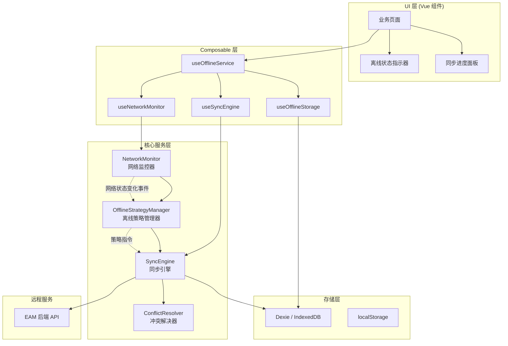
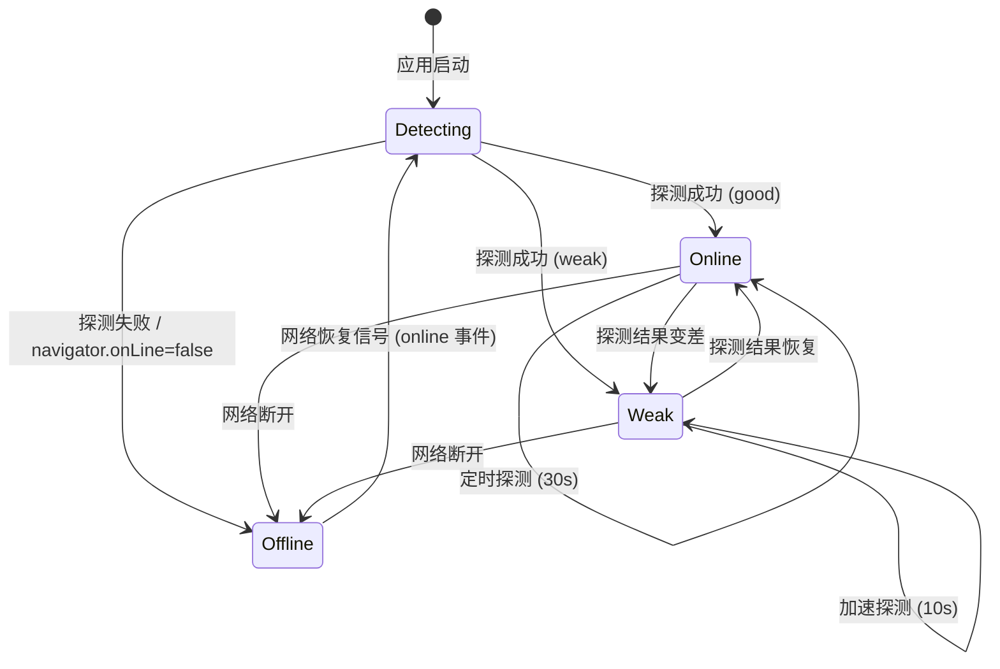
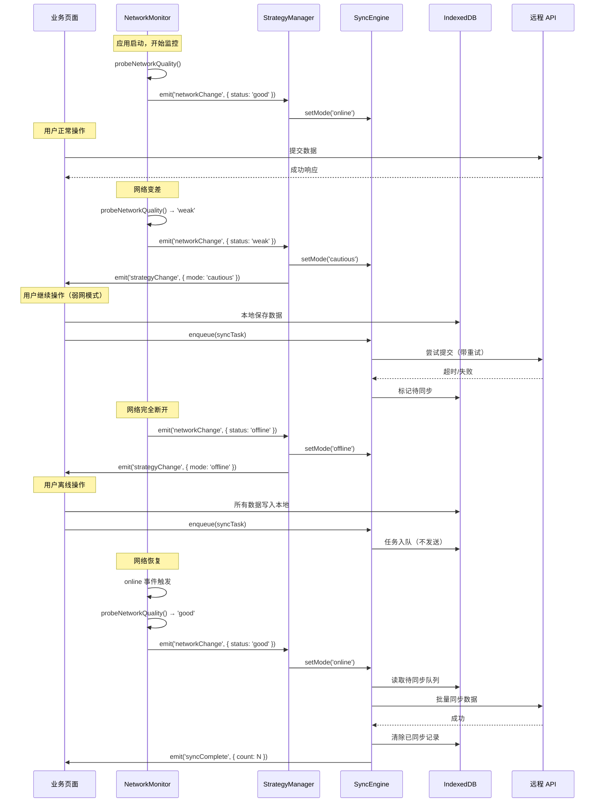
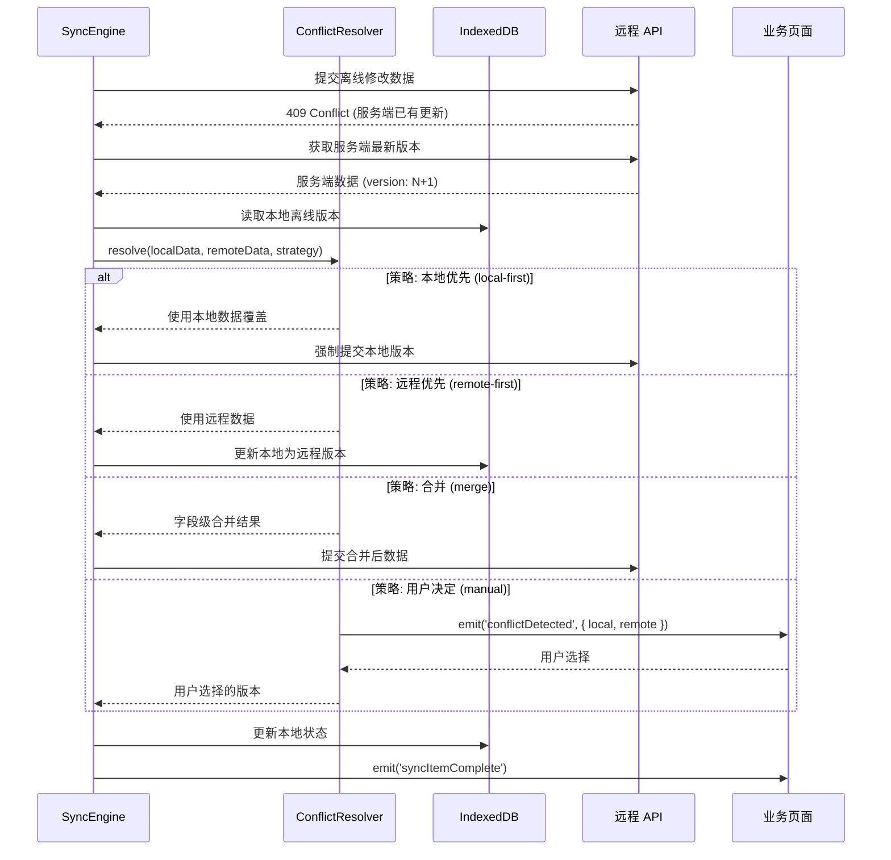

# 设计文档：离线服务系统 (Offline Service)

## 概述

本系统基于现有的 `probeNetworkQuality()` 网络探测函数，构建一套完整的从网络质量检测到离线服务的业务体系。系统核心目标是：在网络不稳定或完全离线的移动端场景（企业微信/微信 H5）下，保障用户能够继续完成巡视、作业等关键业务操作，并在网络恢复后自动同步数据到服务端。

系统采用分层架构设计，包含网络状态监控层、离线策略决策层、本地数据持久化层、数据同步引擎层四个核心模块。基于现有的 Dexie (IndexedDB) 存储基础设施和 Pinia 状态管理，通过 Vue 3 Composable 模式对外暴露统一的离线服务能力。

## 架构

### 整体分层架构



### 网络状态机



## 时序图

### 主流程：网络质量检测 → 离线策略切换 → 数据同步



### 冲突解决流程



## 组件与接口

### 组件 1: NetworkMonitor（网络监控器）

**职责**：持续监控网络状态，提供实时网络质量信息

```typescript
interface NetworkStatus {
  /** 当前网络质量 */
  quality: 'good' | 'weak' | 'offline'
  /** 上次探测时间戳 */
  lastProbeTime: number
  /** 上次探测耗时 (ms) */
  lastProbeDuration: number
  /** 连续失败次数 */
  consecutiveFailures: number
  /** 是否正在探测中 */
  isProbing: boolean
}

interface NetworkMonitorConfig {
  /** 网络良好时的探测间隔 (ms)，默认 30000 */
  goodInterval: number
  /** 网络较差时的探测间隔 (ms)，默认 10000 */
  weakInterval: number
  /** 离线时的探测间隔 (ms)，默认 5000 */
  offlineInterval: number
  /** 探测超时时间 (ms)，默认 1000 */
  probeTimeout: number
  /** 连续失败多少次判定为离线，默认 3 */
  offlineThreshold: number
  /** 探测目标 URL */
  probeUrl: string
}

interface NetworkMonitor {
  /** 当前网络状态（响应式） */
  readonly status: Ref<NetworkStatus>
  /** 启动监控 */
  start(): void
  /** 停止监控 */
  stop(): void
  /** 手动触发一次探测 */
  probe(): Promise<NetworkStatus>
  /** 监听网络状态变化 */
  onStatusChange(callback: (status: NetworkStatus) => void): () => void
}
```

### 组件 2: OfflineStrategyManager（离线策略管理器）

**职责**：根据网络状态决定业务操作的执行策略

```typescript
/** 离线策略模式 */
type OfflineMode = 'online' | 'cautious' | 'offline'

/** 操作类型 */
type OperationType = 'read' | 'write' | 'upload' | 'download'

/** 策略决策结果 */
interface StrategyDecision {
  /** 是否允许执行网络请求 */
  allowNetwork: boolean
  /** 是否需要本地缓存 */
  requireCache: boolean
  /** 是否需要加入同步队列 */
  requireSync: boolean
  /** 重试配置 */
  retry: { maxAttempts: number; backoffMs: number }
  /** 超时配置 (ms) */
  timeout: number
}

interface OfflineStrategyManager {
  /** 当前模式（响应式） */
  readonly mode: Ref<OfflineMode>
  /** 根据操作类型获取策略决策 */
  getStrategy(operation: OperationType): StrategyDecision
  /** 设置模式 */
  setMode(mode: OfflineMode): void
  /** 监听模式变化 */
  onModeChange(callback: (mode: OfflineMode) => void): () => void
}
```

### 组件 3: SyncEngine（同步引擎）

**职责**：管理离线数据的同步队列，在网络恢复时自动同步

```typescript
/** 同步任务状态 */
type SyncTaskStatus = 'pending' | 'syncing' | 'success' | 'failed' | 'conflict'

/** 同步任务 */
interface SyncTask {
  /** 任务唯一 ID */
  id: string
  /** 业务类型 (patrol / work / attachment) */
  businessType: string
  /** 业务数据 ID */
  businessId: string
  /** 操作类型 */
  operation: 'create' | 'update' | 'delete'
  /** 任务状态 */
  status: SyncTaskStatus
  /** 创建时间 */
  createdAt: number
  /** 最后尝试时间 */
  lastAttemptAt?: number
  /** 重试次数 */
  retryCount: number
  /** 最大重试次数 */
  maxRetries: number
  /** 优先级 (数字越小优先级越高) */
  priority: number
  /** 任务载荷数据 */
  payload: Record<string, any>
}

/** 同步进度 */
interface SyncProgress {
  /** 总任务数 */
  total: number
  /** 已完成数 */
  completed: number
  /** 失败数 */
  failed: number
  /** 当前正在同步的任务 */
  current?: SyncTask
  /** 是否正在同步 */
  isSyncing: boolean
}

interface SyncEngine {
  /** 同步进度（响应式） */
  readonly progress: Ref<SyncProgress>
  /** 待同步任务列表（响应式） */
  readonly pendingTasks: Ref<SyncTask[]>
  /** 添加同步任务 */
  enqueue(task: Omit<SyncTask, 'id' | 'status' | 'createdAt' | 'retryCount'>): Promise<string>
  /** 开始同步（网络恢复时自动调用） */
  startSync(): Promise<void>
  /** 停止同步 */
  stopSync(): void
  /** 重试失败的任务 */
  retryFailed(): Promise<void>
  /** 清除已完成的任务 */
  clearCompleted(): Promise<void>
  /** 获取指定业务的同步状态 */
  getTaskStatus(businessId: string): SyncTaskStatus | undefined
  /** 监听同步事件 */
  onSyncEvent(callback: (event: SyncEvent) => void): () => void
}

type SyncEvent =
  | { type: 'taskComplete'; task: SyncTask }
  | { type: 'taskFailed'; task: SyncTask; error: Error }
  | { type: 'conflict'; task: SyncTask; localData: any; remoteData: any }
  | { type: 'allComplete'; summary: { success: number; failed: number } }
```

### 组件 4: ConflictResolver（冲突解决器）

**职责**：处理离线数据与服务端数据的冲突

```typescript
/** 冲突解决策略 */
type ConflictStrategy = 'local-first' | 'remote-first' | 'merge' | 'manual'

/** 冲突信息 */
interface ConflictInfo {
  businessType: string
  businessId: string
  localData: Record<string, any>
  remoteData: Record<string, any>
  localTimestamp: number
  remoteTimestamp: number
}

/** 冲突解决结果 */
interface ConflictResolution {
  /** 最终采用的数据 */
  resolvedData: Record<string, any>
  /** 解决方式 */
  strategy: ConflictStrategy
}

interface ConflictResolver {
  /** 默认策略 */
  defaultStrategy: ConflictStrategy
  /** 解决冲突 */
  resolve(conflict: ConflictInfo): Promise<ConflictResolution>
  /** 注册业务类型的自定义合并逻辑 */
  registerMerger(businessType: string, merger: MergeFunction): void
}

type MergeFunction = (local: Record<string, any>, remote: Record<string, any>) => Record<string, any>
```

## 数据模型

### 同步任务表 (IndexedDB)

```typescript
/** IndexedDB 同步任务记录 */
interface IEamSyncTask {
  /** 任务 ID (UUID) */
  id: string
  /** 业务类型 */
  businessType: string
  /** 业务数据 ID */
  businessId: string
  /** 操作类型 */
  operation: 'create' | 'update' | 'delete'
  /** 任务状态 */
  status: SyncTaskStatus
  /** 优先级 */
  priority: number
  /** 任务载荷 (序列化后的业务数据) */
  payload: Record<string, any>
  /** 创建时间戳 */
  createdAt: number
  /** 最后尝试时间戳 */
  lastAttemptAt: number
  /** 已重试次数 */
  retryCount: number
  /** 最大重试次数 */
  maxRetries: number
  /** 错误信息 (最后一次失败的原因) */
  lastError?: string
}
```

**索引设计**：
- 主键: `id`
- 索引: `status`, `businessType`, `businessId`, `priority`, `createdAt`
- 复合索引: `[status+priority]` (用于按优先级取待同步任务)

**验证规则**：
- `id` 必须为有效 UUID
- `businessType` 不能为空
- `businessId` 不能为空
- `priority` 范围 0-99
- `retryCount` 不能超过 `maxRetries`

### 网络状态快照表 (IndexedDB)

```typescript
/** 网络状态历史记录 (用于分析网络模式) */
interface IEamNetworkSnapshot {
  /** 自增主键 */
  id?: number
  /** 网络质量 */
  quality: 'good' | 'weak' | 'offline'
  /** 探测耗时 (ms) */
  duration: number
  /** 记录时间戳 */
  timestamp: number
}
```

### Dexie Schema 扩展

```typescript
// 在现有 EAMDatabase 基础上扩展
export class EAMDatabase extends Dexie {
  // ... 现有表 ...
  eam_sync_tasks!: Table<IEamSyncTask, string>
  eam_network_snapshots!: Table<IEamNetworkSnapshot, number>

  constructor() {
    super('EAM_Database')

    this.version(5).stores({
      // ... 现有表定义 ...
      eam_sync_tasks: 'id, status, businessType, businessId, priority, createdAt, [status+priority]',
      eam_network_snapshots: '++id, quality, timestamp',
    })
  }
}
```

## 关键函数与形式化规约

### 函数 1: probeNetworkQuality() (增强版)

```typescript
async function probeNetworkQuality(config?: Partial<NetworkMonitorConfig>): Promise<NetworkStatus>
```

**前置条件 (Preconditions)**：
- `config.probeUrl` 为有效的可访问 URL（默认使用 vite.svg）
- `config.probeTimeout` 为正整数

**后置条件 (Postconditions)**：
- 返回的 `NetworkStatus.quality` 必须为 `'good' | 'weak' | 'offline'` 之一
- `lastProbeTime` 等于调用时的时间戳
- `lastProbeDuration` 为非负整数
- 如果 fetch 抛出异常或超时，`quality` 为 `'weak'` 或 `'offline'`
- 如果响应时间 < timeout，`quality` 为 `'good'`
- 函数不产生副作用（不修改全局状态）

**循环不变量**：N/A（无循环）

---

### 函数 2: SyncEngine.enqueue()

```typescript
async function enqueue(
  task: Omit<SyncTask, 'id' | 'status' | 'createdAt' | 'retryCount'>
): Promise<string>
```

**前置条件**：
- `task.businessType` 非空字符串
- `task.businessId` 非空字符串
- `task.operation` 为 `'create' | 'update' | 'delete'` 之一
- `task.payload` 为可序列化对象
- `task.priority` 在 [0, 99] 范围内

**后置条件**：
- 返回新创建任务的 UUID
- 任务已持久化到 IndexedDB `eam_sync_tasks` 表
- 任务初始状态为 `'pending'`
- `createdAt` 等于入队时的时间戳
- `retryCount` 初始为 0
- 如果当前网络模式为 `'online'`，自动触发同步

**循环不变量**：N/A

---

### 函数 3: SyncEngine.startSync()

```typescript
async function startSync(): Promise<void>
```

**前置条件**：
- 当前网络状态不为 `'offline'`
- 没有正在进行的同步过程 (`progress.isSyncing === false`)

**后置条件**：
- 所有 `status === 'pending'` 的任务按 `priority` 升序、`createdAt` 升序处理
- 成功的任务 `status` 变为 `'success'`
- 失败且未超过重试次数的任务 `status` 保持 `'pending'`，`retryCount` 加 1
- 失败且超过重试次数的任务 `status` 变为 `'failed'`
- 冲突的任务 `status` 变为 `'conflict'`
- 同步完成后触发 `'allComplete'` 事件

**循环不变量**：
- 对于已处理的任务集合 P：∀t ∈ P, t.status ∈ {'success', 'failed', 'conflict'}
- 对于未处理的任务集合 U：∀t ∈ U, t.status === 'pending'
- |P| + |U| === 初始待同步任务总数

---

### 函数 4: ConflictResolver.resolve()

```typescript
async function resolve(conflict: ConflictInfo): Promise<ConflictResolution>
```

**前置条件**：
- `conflict.localData` 和 `conflict.remoteData` 均为非空对象
- `conflict.localTimestamp` 和 `conflict.remoteTimestamp` 为有效时间戳
- `conflict.businessType` 已注册对应的合并策略或使用默认策略

**后置条件**：
- 返回的 `resolvedData` 为非空对象
- 返回的 `strategy` 反映实际使用的解决策略
- 如果策略为 `'local-first'`：`resolvedData` 等于 `localData`
- 如果策略为 `'remote-first'`：`resolvedData` 等于 `remoteData`
- 如果策略为 `'merge'`：`resolvedData` 包含两者的合并结果
- 不修改输入参数

**循环不变量**：N/A

## 算法伪代码

### 网络监控算法

```typescript
// NetworkMonitor 核心监控循环
class NetworkMonitorImpl {
  private status: NetworkStatus
  private timer: ReturnType<typeof setTimeout> | null = null
  private config: NetworkMonitorConfig
  private listeners: Set<(status: NetworkStatus) => void> = new Set()

  /**
   * 启动监控循环
   * 
   * 不变量：
   * - timer 在 start() 后始终非 null（除非调用 stop()）
   * - 每次探测完成后，status 反映最新网络状态
   * - consecutiveFailures 在探测成功时重置为 0
   */
  start(): void {
    // 监听浏览器 online/offline 事件作为快速响应通道
    window.addEventListener('online', this.onBrowserOnline)
    window.addEventListener('offline', this.onBrowserOffline)
    // 立即执行首次探测
    this.scheduleProbe(0)
  }

  private async executeProbe(): Promise<void> {
    this.status.isProbing = true
    const start = Date.now()

    try {
      const resp = await fetchWithTimeout(
        `${this.config.probeUrl}?_t=${Date.now()}`,
        { cache: 'no-store' },
        this.config.probeTimeout
      )

      const duration = Date.now() - start
      this.status.lastProbeDuration = duration
      this.status.lastProbeTime = Date.now()

      if (!resp.ok || duration > this.config.probeTimeout) {
        this.handleWeakNetwork()
      } else {
        this.handleGoodNetwork()
      }
    } catch (error) {
      this.status.consecutiveFailures++
      this.status.lastProbeTime = Date.now()

      if (this.status.consecutiveFailures >= this.config.offlineThreshold) {
        this.handleOffline()
      } else {
        this.handleWeakNetwork()
      }
    } finally {
      this.status.isProbing = false
      this.scheduleNextProbe()
    }
  }

  private handleGoodNetwork(): void {
    const previousQuality = this.status.quality
    this.status.quality = 'good'
    this.status.consecutiveFailures = 0
    if (previousQuality !== 'good') {
      this.notifyListeners()
    }
  }

  private handleWeakNetwork(): void {
    const previousQuality = this.status.quality
    this.status.quality = 'weak'
    if (previousQuality !== 'weak') {
      this.notifyListeners()
    }
  }

  private handleOffline(): void {
    const previousQuality = this.status.quality
    this.status.quality = 'offline'
    if (previousQuality !== 'offline') {
      this.notifyListeners()
    }
  }

  private scheduleNextProbe(): void {
    const interval = this.status.quality === 'good'
      ? this.config.goodInterval
      : this.status.quality === 'weak'
        ? this.config.weakInterval
        : this.config.offlineInterval
    this.scheduleProbe(interval)
  }

  private scheduleProbe(delay: number): void {
    if (this.timer) clearTimeout(this.timer)
    this.timer = setTimeout(() => this.executeProbe(), delay)
  }
}
```

### 同步引擎核心算法

```typescript
/**
 * 同步引擎 - 批量同步算法
 *
 * 前置条件：网络状态为 'good' 或 'weak'
 * 后置条件：所有可同步任务已尝试同步，状态已更新
 *
 * 循环不变量：
 * - 已处理任务数 + 未处理任务数 = 初始总任务数
 * - 每个已处理任务的 status ∈ {'success', 'failed', 'conflict'}
 * - 同步过程中 progress 实时反映当前进度
 */
async function executeSyncBatch(tasks: SyncTask[]): Promise<SyncSummary> {
  const summary: SyncSummary = { success: 0, failed: 0, conflicts: 0 }

  // 按优先级排序：priority 升序，同优先级按 createdAt 升序
  const sortedTasks = [...tasks].sort((a, b) => {
    if (a.priority !== b.priority) return a.priority - b.priority
    return a.createdAt - b.createdAt
  })

  for (const task of sortedTasks) {
    // 循环不变量检查点：summary.success + summary.failed + summary.conflicts = 已处理数
    try {
      task.status = 'syncing'
      task.lastAttemptAt = Date.now()
      await updateTaskInDB(task)

      const result = await executeTaskSync(task)

      if (result.success) {
        task.status = 'success'
        summary.success++
        emit({ type: 'taskComplete', task })
      } else if (result.conflict) {
        task.status = 'conflict'
        summary.conflicts++
        emit({ type: 'conflict', task, localData: task.payload, remoteData: result.remoteData })
      } else {
        throw new Error(result.error)
      }
    } catch (error) {
      task.retryCount++
      if (task.retryCount >= task.maxRetries) {
        task.status = 'failed'
        task.lastError = (error as Error).message
        summary.failed++
        emit({ type: 'taskFailed', task, error: error as Error })
      } else {
        task.status = 'pending' // 保持 pending，等待下次重试
      }
    }

    await updateTaskInDB(task)
  }

  emit({ type: 'allComplete', summary })
  return summary
}

/**
 * 单任务同步执行
 *
 * 前置条件：task.status === 'syncing'
 * 后置条件：返回同步结果（成功/冲突/失败）
 */
async function executeTaskSync(task: SyncTask): Promise<SyncResult> {
  const { businessType, businessId, operation, payload } = task

  // 根据业务类型和操作类型路由到对应的 API
  const apiHandler = getApiHandler(businessType, operation)

  try {
    const response = await apiHandler(businessId, payload)
    return { success: true, data: response }
  } catch (error) {
    if (error instanceof HttpError && error.status === 409) {
      // 冲突：获取服务端最新数据
      const remoteData = await fetchRemoteData(businessType, businessId)
      return { success: false, conflict: true, remoteData }
    }
    return { success: false, conflict: false, error: (error as Error).message }
  }
}
```

### 离线策略决策算法

```typescript
/**
 * 策略决策算法
 *
 * 前置条件：mode ∈ {'online', 'cautious', 'offline'}
 * 后置条件：返回的 StrategyDecision 所有字段均有有效值
 */
function getStrategy(mode: OfflineMode, operation: OperationType): StrategyDecision {
  const strategies: Record<OfflineMode, Record<OperationType, StrategyDecision>> = {
    online: {
      read: { allowNetwork: true, requireCache: false, requireSync: false, retry: { maxAttempts: 1, backoffMs: 0 }, timeout: 15000 },
      write: { allowNetwork: true, requireCache: true, requireSync: false, retry: { maxAttempts: 2, backoffMs: 1000 }, timeout: 15000 },
      upload: { allowNetwork: true, requireCache: true, requireSync: false, retry: { maxAttempts: 2, backoffMs: 2000 }, timeout: 30000 },
      download: { allowNetwork: true, requireCache: true, requireSync: false, retry: { maxAttempts: 2, backoffMs: 1000 }, timeout: 30000 },
    },
    cautious: {
      read: { allowNetwork: true, requireCache: true, requireSync: false, retry: { maxAttempts: 2, backoffMs: 2000 }, timeout: 10000 },
      write: { allowNetwork: true, requireCache: true, requireSync: true, retry: { maxAttempts: 3, backoffMs: 3000 }, timeout: 10000 },
      upload: { allowNetwork: false, requireCache: true, requireSync: true, retry: { maxAttempts: 0, backoffMs: 0 }, timeout: 0 },
      download: { allowNetwork: true, requireCache: true, requireSync: false, retry: { maxAttempts: 2, backoffMs: 2000 }, timeout: 20000 },
    },
    offline: {
      read: { allowNetwork: false, requireCache: true, requireSync: false, retry: { maxAttempts: 0, backoffMs: 0 }, timeout: 0 },
      write: { allowNetwork: false, requireCache: true, requireSync: true, retry: { maxAttempts: 0, backoffMs: 0 }, timeout: 0 },
      upload: { allowNetwork: false, requireCache: true, requireSync: true, retry: { maxAttempts: 0, backoffMs: 0 }, timeout: 0 },
      download: { allowNetwork: false, requireCache: true, requireSync: false, retry: { maxAttempts: 0, backoffMs: 0 }, timeout: 0 },
    },
  }

  return strategies[mode][operation]
}
```

## 示例用法

### 基础用法：在业务页面中使用离线服务

```typescript
// 在 Vue 组件中使用
import { useOfflineService } from '@/hooks/useOfflineService'

const {
  networkStatus,   // Ref<NetworkStatus> - 当前网络状态
  offlineMode,     // Ref<OfflineMode> - 当前离线模式
  syncProgress,    // Ref<SyncProgress> - 同步进度
  pendingCount,    // Ref<number> - 待同步任务数
  submitWithOfflineSupport,  // 带离线支持的提交函数
  forceSyncNow,    // 手动触发同步
} = useOfflineService()

// 提交巡视数据（自动处理离线场景）
async function submitPatrolData(patrolId: string, data: Record<string, any>) {
  await submitWithOfflineSupport({
    businessType: 'patrol',
    businessId: patrolId,
    operation: 'update',
    payload: data,
    priority: 1, // 高优先级
    maxRetries: 5,
  })
}
```

### 完整工作流示例

```typescript
// src/hooks/useOfflineService.ts
import { computed, onMounted, onUnmounted } from 'vue'
import { useNetworkMonitor } from './useNetworkMonitor'
import { useSyncEngine } from './useSyncEngine'

export function useOfflineService() {
  const { status: networkStatus, start, stop, probe } = useNetworkMonitor()
  const { enqueue, startSync, progress, pendingTasks } = useSyncEngine()

  const offlineMode = computed<OfflineMode>(() => {
    switch (networkStatus.value.quality) {
      case 'good': return 'online'
      case 'weak': return 'cautious'
      case 'offline': return 'offline'
    }
  })

  const pendingCount = computed(() => pendingTasks.value.length)

  // 带离线支持的数据提交
  async function submitWithOfflineSupport(taskInput: {
    businessType: string
    businessId: string
    operation: 'create' | 'update' | 'delete'
    payload: Record<string, any>
    priority?: number
    maxRetries?: number
  }) {
    const strategy = getStrategy(offlineMode.value, 'write')

    if (strategy.allowNetwork) {
      try {
        // 尝试直接提交
        const apiHandler = getApiHandler(taskInput.businessType, taskInput.operation)
        await apiHandler(taskInput.businessId, taskInput.payload)
        return { success: true, synced: true }
      } catch (error) {
        if (!strategy.requireSync) throw error
        // 网络请求失败，降级到离线模式
      }
    }

    // 离线模式：本地保存 + 加入同步队列
    await saveToLocal(taskInput.businessType, taskInput.businessId, taskInput.payload)
    const taskId = await enqueue({
      businessType: taskInput.businessType,
      businessId: taskInput.businessId,
      operation: taskInput.operation,
      payload: taskInput.payload,
      priority: taskInput.priority ?? 5,
      maxRetries: taskInput.maxRetries ?? 3,
    })

    return { success: true, synced: false, taskId }
  }

  // 网络恢复时自动同步
  const unwatch = watch(
    () => networkStatus.value.quality,
    (newQuality, oldQuality) => {
      if (oldQuality !== 'good' && newQuality === 'good') {
        // 网络恢复，自动开始同步
        startSync()
      }
    }
  )

  onMounted(() => start())
  onUnmounted(() => {
    stop()
    unwatch()
  })

  return {
    networkStatus,
    offlineMode,
    syncProgress: progress,
    pendingCount,
    submitWithOfflineSupport,
    forceSyncNow: startSync,
    manualProbe: probe,
  }
}
```

### 离线状态 UI 指示器

```typescript
// 在 App.vue 或 Layout 中使用
<template>
  <div class="offline-indicator" v-if="offlineMode !== 'online'">
    <van-notice-bar
      :text="indicatorText"
      :color="indicatorColor"
      left-icon="info-o"
    />
    <van-badge :content="pendingCount" v-if="pendingCount > 0" />
  </div>
</template>

<script setup lang="ts">
import { useOfflineService } from '@/hooks/useOfflineService'

const { offlineMode, pendingCount } = useOfflineService()

const indicatorText = computed(() => {
  switch (offlineMode.value) {
    case 'cautious': return '网络不稳定，数据将自动保存到本地'
    case 'offline': return '当前离线，数据已保存到本地，联网后自动同步'
    default: return ''
  }
})

const indicatorColor = computed(() => {
  return offlineMode.value === 'offline' ? '#ee0a24' : '#ff976a'
})
</script>
```

## 正确性属性 (Correctness Properties)

```typescript
// 属性 1: 网络状态一致性
// ∀ probe result r: r.quality ∈ {'good', 'weak', 'offline'}
// 且 quality 的转换遵循状态机定义
assert(
  ['good', 'weak', 'offline'].includes(networkStatus.quality),
  '网络状态必须为有效枚举值'
)

// 属性 2: 同步任务持久性
// ∀ task t: enqueue(t) 成功后，t 必须存在于 IndexedDB 中
// 直到 t.status 变为 'success' 并被显式清除
const task = await db.eam_sync_tasks.get(taskId)
assert(task !== undefined, '入队的任务必须持久化到 IndexedDB')

// 属性 3: 同步顺序保证
// ∀ tasks t1, t2: 如果 t1.priority < t2.priority，则 t1 先于 t2 被同步
// 如果 t1.priority === t2.priority 且 t1.createdAt < t2.createdAt，则 t1 先于 t2 被同步

// 属性 4: 数据不丢失
// ∀ 用户操作 op: 无论网络状态如何，op 的数据要么已同步到服务端，要么存在于本地 IndexedDB 中
// 即：synced(op) ∨ existsInLocal(op)

// 属性 5: 幂等性
// ∀ sync task t: 重复执行 t 不会产生重复数据
// 即：execute(t) 多次的效果等同于执行一次

// 属性 6: 冲突检测完整性
// ∀ 离线修改 m: 如果服务端在 m 创建后有更新，同步时必须检测到冲突
// 即：remoteVersion > localBaseVersion → conflict detected

// 属性 7: 离线模式下无网络请求
// ∀ operation op in offline mode: allowNetwork === false → 不发起任何 fetch 请求
```

## 错误处理

### 场景 1: 网络探测超时

**条件**：`fetchWithTimeout` 在指定超时时间内未收到响应
**响应**：将网络状态标记为 `'weak'`，增加 `consecutiveFailures` 计数
**恢复**：下次探测成功时自动恢复状态，重置失败计数

### 场景 2: IndexedDB 写入失败

**条件**：Dexie 操作抛出 `QuotaExceededError` 或其他 DOMException
**响应**：
- 如果是存储空间不足：清理过期的网络快照记录和已完成的同步任务
- 如果是其他错误：降级到 localStorage 临时存储，并通知用户
**恢复**：空间释放后自动恢复正常写入

### 场景 3: 同步过程中网络再次断开

**条件**：`startSync()` 执行过程中网络状态变为 `'offline'`
**响应**：
- 立即停止当前同步批次
- 当前正在执行的任务标记为 `'pending'`（不增加重试次数）
- 已成功的任务保持 `'success'` 状态
**恢复**：网络再次恢复时从断点继续

### 场景 4: 服务端返回 409 冲突

**条件**：同步提交时服务端检测到版本冲突
**响应**：
- 任务状态标记为 `'conflict'`
- 获取服务端最新数据
- 调用 `ConflictResolver.resolve()` 处理冲突
**恢复**：根据冲突解决策略自动或手动解决后重新提交

### 场景 5: Token 过期

**条件**：同步请求返回 401 Unauthorized
**响应**：
- 暂停同步队列
- 触发重新登录流程（企业微信 OAuth）
- 所有待同步任务保持 `'pending'` 状态
**恢复**：重新获取 Token 后恢复同步

## 测试策略

### 单元测试

- NetworkMonitor: 测试状态转换逻辑、探测间隔计算、事件触发
- OfflineStrategyManager: 测试各模式下的策略决策正确性
- SyncEngine: 测试任务入队、排序、状态流转
- ConflictResolver: 测试各策略的冲突解决结果

### 属性测试 (Property-Based Testing)

**测试库**: fast-check

```typescript
// 属性：任意网络状态序列下，系统状态始终有效
fc.assert(
  fc.property(
    fc.array(fc.constantFrom('good', 'weak', 'offline')),
    (statusSequence) => {
      const monitor = createNetworkMonitor()
      for (const status of statusSequence) {
        monitor.simulateProbeResult(status)
      }
      return ['good', 'weak', 'offline'].includes(monitor.status.quality)
    }
  )
)

// 属性：任意任务集合，同步后不丢失数据
fc.assert(
  fc.property(
    fc.array(fc.record({
      businessType: fc.constantFrom('patrol', 'work', 'attachment'),
      businessId: fc.uuid(),
      priority: fc.integer({ min: 0, max: 99 }),
    })),
    async (tasks) => {
      const engine = createSyncEngine()
      const ids = await Promise.all(tasks.map(t => engine.enqueue(t)))
      const stored = await db.eam_sync_tasks.bulkGet(ids)
      return stored.every(t => t !== undefined)
    }
  )
)
```

### 集成测试

- 模拟网络状态切换，验证端到端的离线→在线同步流程
- 模拟并发冲突场景，验证冲突解决机制
- 模拟存储空间不足，验证降级策略

## 性能考量

1. **探测请求轻量化**：使用小体积静态资源（vite.svg ~1KB）作为探测目标，避免占用带宽
2. **同步批量化**：网络恢复时批量同步而非逐条同步，减少 HTTP 连接开销
3. **IndexedDB 事务优化**：批量写入使用 `bulkPut`，避免频繁开启事务
4. **网络快照清理**：定期清理超过 24 小时的网络快照记录，控制存储增长
5. **探测频率自适应**：网络良好时降低探测频率（30s），网络差时提高频率（10s），平衡实时性与资源消耗
6. **同步队列大小限制**：单次同步批次最多处理 50 个任务，避免长时间阻塞

## 安全考量

1. **Token 安全**：同步请求复用现有的 JWT Token 机制，Token 过期时暂停同步并触发重新认证
2. **数据加密**：IndexedDB 中的敏感业务数据（如工单详情）建议在写入前加密，读取时解密
3. **防重放**：同步任务携带唯一 ID 和时间戳，服务端可据此防止重放攻击
4. **存储隔离**：不同用户的离线数据通过 `userId` 前缀隔离，切换账号时清理前用户数据

## 依赖

### 现有依赖（无需新增）

| 依赖 | 用途 |
|------|------|
| `dexie` ^4.3.0 | IndexedDB ORM，离线数据持久化 |
| `pinia` ^3.0.4 | 全局状态管理（网络状态、同步进度） |
| `@vueuse/core` ^14.2.1 | 响应式工具（useEventListener、useIntervalFn 等） |
| `vant` ^4.9.22 | UI 组件（通知栏、Toast、Badge 等） |
| `vue` ^3.5.25 | 响应式系统、Composable 模式 |

### 可选新增依赖

| 依赖 | 用途 | 是否必须 |
|------|------|----------|
| `uuid` | 生成同步任务唯一 ID | 否（可用 crypto.randomUUID()） |
