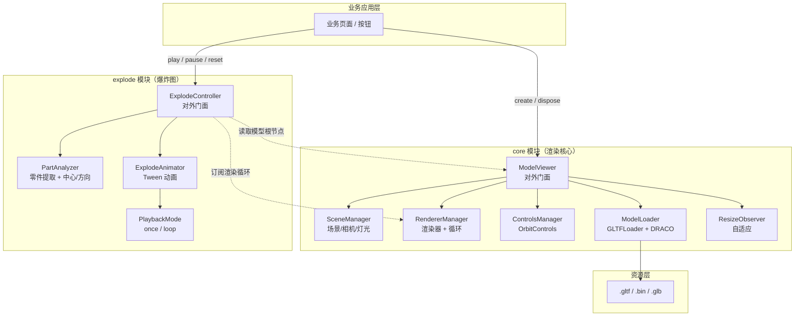
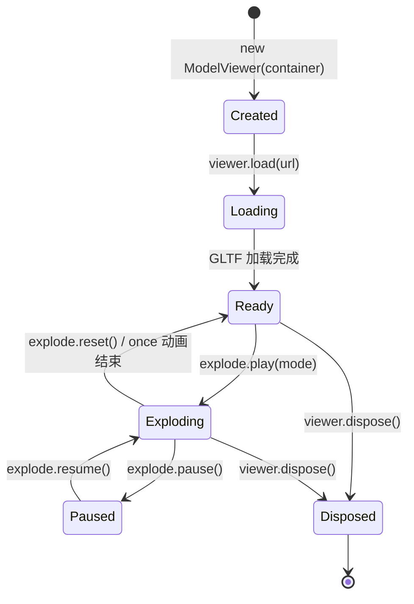
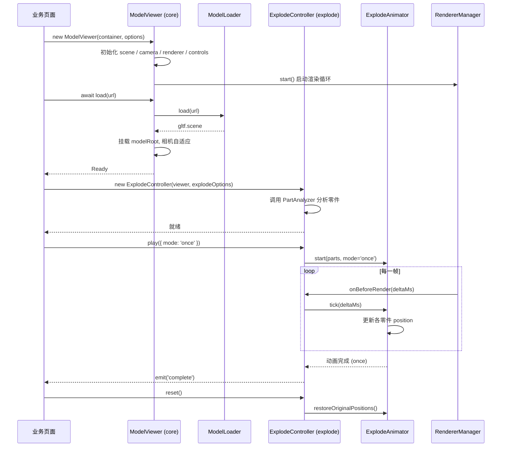
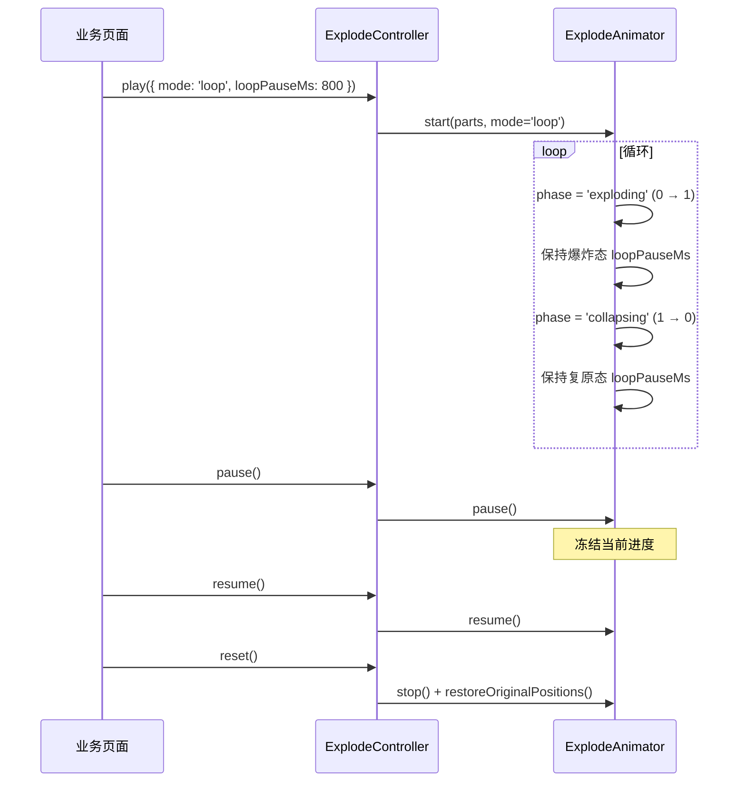

# 设计文档：Three.js 模型爆炸图组件 (threejs-model-explode)

## 概述

本模块面向"模型厂商批量提供 glTF/bin 模型 + 在 Web 端进行结构拆解展示"的业务场景，基于 Three.js 封装一套边界清晰、可组合的渲染与爆炸图组件。业务方只需传入模型资源地址与挂载容器，即可完成模型加载、渲染、轨道操作、以及「单次 / 循环」两种爆炸图动画的播放控制。

设计上将整体能力拆分成两个高内聚、低耦合的核心模块：**`core` 渲染核心模块**（封装 Three.js 的场景、相机、渲染器、控制器、模型加载等基础能力）和 **`explode` 爆炸图模块**（封装零件位移计算、动画调度与播放控制）。两个模块通过最小依赖面（核心模块仅向爆炸模块暴露「模型根节点」和「渲染循环钩子」）进行协作，便于独立测试、替换与复用。

所有公开 API 均提供 TypeScript 类型定义，动画播放基于 `requestAnimationFrame` 与时间驱动（非帧驱动），确保在不同刷新率设备上表现一致；同时使用 Tween/缓动函数控制零件位移曲线，支持暂停、恢复、复原、循环。

## 架构

### 整体模块划分



### 生命周期与渲染循环



### 模块边界约定

| 模块 | 输入 | 输出 | 不做的事 |
|------|------|------|----------|
| `core` | 容器 DOM、模型 URL、渲染配置 | `ModelViewer` 实例（含 `scene`、`camera`、`modelRoot`、`onBeforeRender` 钩子） | 不知道"爆炸图"概念、不操作零件位移 |
| `explode` | `ModelViewer` 实例 或 `modelRoot + 渲染钩子`、爆炸配置 | `ExplodeController`（含 `play/pause/reset/onComplete`） | 不负责场景、相机、灯光、模型加载 |

爆炸模块依赖核心模块暴露的**最小接口**（`ViewerHandle`），不直接依赖 Three.js 的 `WebGLRenderer` / `OrbitControls`，便于在非 `ModelViewer` 场景下复用。

## 时序图

### 主流程：模型加载 → 渲染 → 单次爆炸 → 复原



### 循环爆炸流程



## 组件与接口

### core 模块

#### 组件 1: ModelViewer（对外门面）

**职责**：核心模块的对外入口。承担容器挂载、场景/相机/渲染器/控制器初始化、模型加载、渲染循环的生命周期管理。

```typescript
interface ViewerOptions {
  /** 背景色，默认 0xf0f0f0 */
  background?: number | string
  /** 相机 fov，默认 45 */
  fov?: number
  /** 相机初始距离（以模型包围球半径为单位），默认 2.5 */
  cameraDistanceScale?: number
  /** 是否启用环境光，默认 true */
  enableAmbientLight?: boolean
  /** 是否启用 OrbitControls，默认 true */
  enableControls?: boolean
  /** DRACO 解码器路径（可选，若模型使用 draco 压缩需提供） */
  dracoDecoderPath?: string
  /** 开发模式：显示坐标轴、包围盒 */
  debug?: boolean
}

interface ModelViewer extends ViewerHandle {
  /** 加载一个 glTF / glb 模型，旧模型会被自动卸载 */
  load(url: string): Promise<Object3D>
  /** 卸载当前模型但保留 viewer */
  unload(): void
  /** 销毁 viewer，释放所有 WebGL 资源 */
  dispose(): void
  /** 手动触发一次相机对焦到当前模型 */
  fitCameraToModel(): void
  /** 暴露只读引用，供 explode 等外部模块使用 */
  readonly scene: Scene
  readonly camera: PerspectiveCamera
  readonly renderer: WebGLRenderer
  readonly controls: OrbitControls | null
  readonly modelRoot: Object3D | null
}
```

#### 组件 2: ViewerHandle（最小对外契约）

**职责**：`core` → `explode` 的**唯一接口**。爆炸模块只依赖此接口，不依赖 `ModelViewer` 具体实现，便于替换与单测。

```typescript
/** 渲染循环回调，deltaMs 为两帧之间的毫秒数 */
type RenderTickFn = (deltaMs: number, elapsedMs: number) => void

interface ViewerHandle {
  /** 当前加载的模型根节点，未加载时为 null */
  readonly modelRoot: Object3D | null
  /** 订阅每一帧渲染前的回调，返回取消订阅函数 */
  onBeforeRender(fn: RenderTickFn): () => void
  /** 订阅模型加载完成事件 */
  onModelLoaded(fn: (root: Object3D) => void): () => void
}
```

#### 组件 3: SceneManager

**职责**：封装 `THREE.Scene`、相机、默认灯光的创建与资源清理。

```typescript
interface SceneManager {
  readonly scene: Scene
  readonly camera: PerspectiveCamera
  /** 根据模型包围盒调整相机位置 */
  fitCameraToObject(object: Object3D, distanceScale: number): void
  /** 处理容器尺寸变化 */
  updateAspect(width: number, height: number): void
  dispose(): void
}
```

#### 组件 4: RendererManager

**职责**：封装 `WebGLRenderer`、渲染循环、`ResizeObserver`、`onBeforeRender` 订阅机制。

```typescript
interface RendererManager {
  readonly renderer: WebGLRenderer
  /** 启动渲染循环 */
  start(scene: Scene, camera: Camera): void
  /** 停止渲染循环 */
  stop(): void
  /** 注册每帧渲染前回调 */
  onBeforeRender(fn: RenderTickFn): () => void
  /** 尺寸更新 */
  setSize(width: number, height: number): void
  dispose(): void
}
```

#### 组件 5: ModelLoader

**职责**：封装 `GLTFLoader`、`DRACOLoader`，处理 glTF + bin 的加载。

```typescript
interface ModelLoadResult {
  /** 模型根节点 */
  root: Object3D
  /** 原始 gltf 对象，便于高级场景扩展 */
  raw: GLTF
  /** 模型包围盒 */
  boundingBox: Box3
}

interface ModelLoader {
  /** 加载模型，支持 .gltf / .glb */
  load(url: string, onProgress?: (pct: number) => void): Promise<ModelLoadResult>
  /** 释放内部解码器 */
  dispose(): void
}
```

### explode 模块

#### 组件 1: ExplodeController（对外门面）

**职责**：爆炸图模块的对外入口。协调零件分析器与动画器，提供「播放 / 暂停 / 恢复 / 复原 / 事件」的完整控制面。

```typescript
/** 爆炸播放模式 */
type PlaybackMode = 'once' | 'loop'

/** 爆炸方向策略 */
type ExplodeDirection =
  /** 以模型包围盒中心向外辐射（默认，适用于大多数装配体） */
  | 'radial'
  /** 沿指定轴向展开（如装配体是沿 Y 轴堆叠） */
  | 'axis-x' | 'axis-y' | 'axis-z'
  /** 自定义方向函数：传入零件中心与模型中心，返回单位向量 */
  | ((partCenter: Vector3, modelCenter: Vector3) => Vector3)

interface ExplodeOptions {
  /** 爆炸强度（位移 = 强度 × 零件到中心的距离），默认 1.5 */
  strength?: number
  /** 爆炸方向策略，默认 'radial' */
  direction?: ExplodeDirection
  /** 单向动画时长 (ms)，默认 1000 */
  durationMs?: number
  /** 缓动函数，默认 easeInOutCubic */
  easing?: EasingFn
  /** loop 模式下，到达两端后的停留时间 (ms)，默认 600 */
  loopPauseMs?: number
  /** 零件过滤器：返回 true 表示该 Mesh 参与爆炸，默认全部参与 */
  partFilter?: (mesh: Mesh) => boolean
  /** 是否递归分组：true 时按父 Group 作为爆炸单元，false 时每个 Mesh 独立，默认 true */
  groupByParent?: boolean
}

interface PlayOptions {
  /** 播放模式 */
  mode: PlaybackMode
  /** 是否从当前进度继续（仅在 resume 场景内部使用） */
  resume?: boolean
}

type ExplodeEvent =
  | { type: 'start'; mode: PlaybackMode }
  | { type: 'progress'; progress: number; phase: 'exploding' | 'collapsing' }
  | { type: 'complete'; mode: PlaybackMode }
  | { type: 'pause' }
  | { type: 'resume' }
  | { type: 'reset' }

interface ExplodeController {
  /** 当前是否正在播放 */
  readonly isPlaying: boolean
  /** 当前进度 0..1 */
  readonly progress: number
  /** 当前阶段 */
  readonly phase: 'exploding' | 'collapsing' | 'idle'

  /** 开始播放 */
  play(options: PlayOptions): void
  /** 暂停（保留当前进度） */
  pause(): void
  /** 从暂停处恢复 */
  resume(): void
  /** 停止并复原到初始位置 */
  reset(): void
  /** 订阅事件，返回取消订阅函数 */
  on(fn: (e: ExplodeEvent) => void): () => void
  /** 释放资源 */
  dispose(): void
}
```

#### 组件 2: PartAnalyzer（零件分析器）

**职责**：遍历模型根节点，提取「爆炸单元」并计算每个单元的初始位置、中心、方向向量。

```typescript
interface ExplodePart {
  /** 该爆炸单元对应的 Three.js 对象（Mesh 或 Group） */
  target: Object3D
  /** 爆炸前的本地位置（相对父节点），用于复原 */
  originalPosition: Vector3
  /** 爆炸单元的世界中心 */
  worldCenter: Vector3
  /** 爆炸位移向量（单位向量 × 最大位移距离） */
  displacement: Vector3
}

interface PartAnalyzer {
  /** 遍历模型并产出爆炸单元 */
  analyze(modelRoot: Object3D, options: ExplodeOptions): ExplodePart[]
}
```

#### 组件 3: ExplodeAnimator（动画器）

**职责**：管理每一帧零件位置的插值计算；支持 once / loop 两种模式的状态机；接收外部 tick 驱动。

```typescript
type EasingFn = (t: number) => number  // t ∈ [0, 1]

interface ExplodeAnimator {
  /** 开始播放 */
  start(parts: ExplodePart[], mode: PlaybackMode, options: Required<ExplodeOptions>): void
  /** 每一帧驱动，返回当前是否仍在播放 */
  tick(deltaMs: number): boolean
  pause(): void
  resume(): void
  /** 停止并将零件位置重置为 originalPosition */
  stop(): void
  readonly progress: number
  readonly phase: 'exploding' | 'collapsing' | 'idle'
  readonly isPlaying: boolean
}
```

## 数据模型

### 模型 1: ViewerOptions / ExplodeOptions

见「组件与接口」章节。所有可选字段均有默认值，业务方仅传入差异部分。

**验证规则**：
- `fov` ∈ (0, 180)
- `cameraDistanceScale` > 0
- `strength` > 0
- `durationMs` > 0
- `loopPauseMs` >= 0
- `easing` 必须满足 `easing(0) === 0 && easing(1) === 1`

### 模型 2: ExplodePart（内部数据）

```typescript
interface ExplodePart {
  target: Object3D          // 引用 modelRoot 子节点
  originalPosition: Vector3 // 快照，不可变
  worldCenter: Vector3      // 初始世界中心，不可变
  displacement: Vector3     // 爆炸终点相对 originalPosition 的增量向量
}
```

**不变量**：
- `target.parent !== null`（必须已挂载到场景树）
- `originalPosition.equals(target.position)` 在 `analyze()` 完成的那一瞬间成立
- `displacement.length() === strength × distanceFromCenter`（radial 模式下）

### 模型 3: PlaybackState（内部状态机）

```typescript
type PlaybackState =
  | { phase: 'idle' }
  | { phase: 'exploding'; elapsedMs: number; mode: PlaybackMode }
  | { phase: 'paused-at-exploded'; elapsedPauseMs: number } // 仅 loop
  | { phase: 'collapsing'; elapsedMs: number }              // 仅 loop
  | { phase: 'paused-at-collapsed'; elapsedPauseMs: number }// 仅 loop
  | { phase: 'paused'; savedState: PlaybackState }          // 外部暂停
```

### 模型 4: 事件载荷

见 `ExplodeEvent` 定义。

## 关键函数与形式化规约

### 函数 1: `ModelViewer.load(url)`

```typescript
async load(url: string): Promise<Object3D>
```

**前置条件**：
- `url` 非空字符串，指向有效的 `.gltf` 或 `.glb` 资源
- `this` 未被 `dispose()`

**后置条件**：
- 旧模型（如有）已从 `scene` 移除并释放几何体/纹理
- 新模型已挂载到 `scene`，`modelRoot` 指向其根节点
- 相机已自适应到新模型的包围盒
- 触发 `onModelLoaded` 事件
- 返回值等于 `this.modelRoot`

**异常**：加载失败时 `modelRoot` 保持原值（旧模型若已卸载，`modelRoot` 为 `null`），异常向外抛出。

### 函数 2: `PartAnalyzer.analyze(modelRoot, options)`

```typescript
analyze(modelRoot: Object3D, options: ExplodeOptions): ExplodePart[]
```

**前置条件**：
- `modelRoot !== null` 且已挂载到 `scene`
- `modelRoot.updateMatrixWorld()` 已被调用（函数内部会再次调用以保证）
- `options.strength > 0 && options.durationMs > 0`

**后置条件**：
- 返回数组中每个元素满足 `ExplodePart` 的不变量
- 不修改 `modelRoot` 及其子节点的 `position`
- 对于 `groupByParent=true`，同一父 Group 下的 Mesh 合并为一个爆炸单元；其中 `target` 指向该父 Group
- 对于 `partFilter`，被过滤掉的 Mesh 不出现在返回数组中
- 返回数组顺序稳定（按深度优先遍历）

### 函数 3: `ExplodeAnimator.tick(deltaMs)`

```typescript
tick(deltaMs: number): boolean  // 返回是否仍在播放
```

**前置条件**：
- `deltaMs >= 0`
- `start()` 已被调用

**后置条件**：
- 所有 `parts[i].target.position` 被更新为 `originalPosition + easing(progress) × displacement`，其中 `progress` 由当前 `phase` 和 `elapsedMs` 推导得出
- 返回 `true` 当且仅当动画仍在进行（loop 模式下始终返回 `true`，直到 `stop()`）
- once 模式下，当 `progress` 到达 1 时，触发 `complete` 事件并返回 `false`
- 暂停状态下调用 `tick` 不改变 `progress` 并返回 `true`

**循环不变量**（针对多次 tick 调用）：
- ∀ i：`parts[i].target.position` 始终在 `originalPosition` 与 `originalPosition + displacement` 构成的线段上
- `progress ∈ [0, 1]`
- 一次 `start()` 到 `stop()` 之间，`parts[i].originalPosition` 不被修改

### 函数 4: `ExplodeController.reset()`

```typescript
reset(): void
```

**前置条件**：无（可在任意状态调用）

**后置条件**：
- `animator.phase === 'idle'`
- ∀ 零件 p: `p.target.position.equals(p.originalPosition)` （浮点容差 < 1e-6）
- 触发 `reset` 事件
- 后续 `play()` 可正常启动

## 算法伪代码

### 算法 1: 零件分析（radial 模式）

```pascal
ALGORITHM analyzeParts(modelRoot, options)
INPUT: modelRoot ∈ Object3D, options ∈ ExplodeOptions
OUTPUT: parts ∈ ExplodePart[]

BEGIN
  ASSERT modelRoot ≠ null

  modelRoot.updateMatrixWorld(true)

  // Step 1: 计算模型整体中心
  bbox ← new Box3().setFromObject(modelRoot)
  modelCenter ← bbox.getCenter()

  // Step 2: 确定爆炸单元集合
  IF options.groupByParent = true THEN
    candidates ← 收集 modelRoot 下所有「直接包含 Mesh 的 Group 节点」或「散挂的 Mesh」
  ELSE
    candidates ← 收集 modelRoot 下所有 Mesh
  END IF

  // Step 3: 过滤
  IF options.partFilter ≠ undefined THEN
    candidates ← candidates.filter(options.partFilter)
  END IF

  parts ← []

  FOR each node IN candidates DO
    ASSERT node.parent ≠ null  // 循环不变量：候选节点必须已挂载

    // 计算该单元的世界中心
    nodeBox ← new Box3().setFromObject(node)
    worldCenter ← nodeBox.getCenter()

    // 计算方向向量
    direction ← computeDirection(worldCenter, modelCenter, options.direction)
    distance ← worldCenter.distanceTo(modelCenter)
    displacement ← direction.multiplyScalar(options.strength × distance)

    parts.push({
      target: node,
      originalPosition: node.position.clone(),
      worldCenter: worldCenter.clone(),
      displacement: displacement
    })
  END FOR

  ASSERT ∀ p ∈ parts: p.originalPosition.equals(p.target.position)

  RETURN parts
END


PROCEDURE computeDirection(partCenter, modelCenter, strategy)
  SEQUENCE
    IF strategy = 'radial' THEN
      dir ← partCenter.clone().sub(modelCenter)
      IF dir.lengthSq() < EPSILON THEN
        // 零件与模型中心重合（通常是中心件），固定一个向上方向避免 NaN
        RETURN Vector3(0, 1, 0)
      END IF
      RETURN dir.normalize()
    ELSE IF strategy = 'axis-x' THEN
      RETURN Vector3(sign(partCenter.x - modelCenter.x), 0, 0)
    ELSE IF strategy = 'axis-y' THEN
      RETURN Vector3(0, sign(partCenter.y - modelCenter.y), 0)
    ELSE IF strategy = 'axis-z' THEN
      RETURN Vector3(0, 0, sign(partCenter.z - modelCenter.z))
    ELSE IF strategy IS Function THEN
      RETURN strategy(partCenter, modelCenter).normalize()
    END IF
  END SEQUENCE
END PROCEDURE
```

**前置条件**：`modelRoot` 非空且已挂载  
**后置条件**：返回数组每项满足 `ExplodePart` 不变量；不修改任何节点的 `position`  
**循环不变量**：循环中每个 `candidate.parent !== null`；累积的 `parts` 长度等于已处理候选数

### 算法 2: 爆炸动画状态机（once & loop）

```pascal
ALGORITHM animationTick(state, parts, deltaMs, options)
INPUT:  state ∈ PlaybackState, parts ∈ ExplodePart[], deltaMs ∈ ℝ≥0, options ∈ ExplodeOptions
OUTPUT: nextState ∈ PlaybackState, stillPlaying ∈ Boolean, event ∈ Optional<ExplodeEvent>

BEGIN
  event ← null

  CASE state.phase OF
    'idle':
      RETURN (state, false, null)

    'paused':
      // 外部暂停：冻结，不推进时间
      RETURN (state, true, null)

    'exploding':
      state.elapsedMs ← state.elapsedMs + deltaMs
      progress ← min(state.elapsedMs / options.durationMs, 1)
      applyPositions(parts, options.easing(progress))

      IF progress >= 1 THEN
        IF state.mode = 'once' THEN
          event ← { type: 'complete', mode: 'once' }
          RETURN ({ phase: 'idle' }, false, event)
        ELSE  // loop
          RETURN ({ phase: 'paused-at-exploded', elapsedPauseMs: 0 }, true, null)
        END IF
      END IF

    'paused-at-exploded':
      state.elapsedPauseMs ← state.elapsedPauseMs + deltaMs
      IF state.elapsedPauseMs >= options.loopPauseMs THEN
        RETURN ({ phase: 'collapsing', elapsedMs: 0 }, true, null)
      END IF

    'collapsing':
      state.elapsedMs ← state.elapsedMs + deltaMs
      progress ← min(state.elapsedMs / options.durationMs, 1)
      applyPositions(parts, options.easing(1 - progress))

      IF progress >= 1 THEN
        RETURN ({ phase: 'paused-at-collapsed', elapsedPauseMs: 0 }, true, null)
      END IF

    'paused-at-collapsed':
      state.elapsedPauseMs ← state.elapsedPauseMs + deltaMs
      IF state.elapsedPauseMs >= options.loopPauseMs THEN
        // 再次爆炸
        RETURN ({ phase: 'exploding', elapsedMs: 0, mode: 'loop' }, true, null)
      END IF
  END CASE

  RETURN (state, true, event)
END


PROCEDURE applyPositions(parts, t)
  // 不变量：t ∈ [0, 1]；调用前后 originalPosition 不变
  ASSERT 0 ≤ t ≤ 1

  FOR each p IN parts DO
    p.target.position.x ← p.originalPosition.x + p.displacement.x × t
    p.target.position.y ← p.originalPosition.y + p.displacement.y × t
    p.target.position.z ← p.originalPosition.z + p.displacement.z × t
  END FOR
END PROCEDURE
```

**前置条件**：
- `parts` 由 `analyze()` 产出且自此之后 `originalPosition` 未被外部修改
- `options` 已填充所有默认值
- `deltaMs >= 0`

**后置条件**：
- 返回的 `nextState` 始终符合 `PlaybackState` 定义
- 每个零件位置是 `originalPosition` 与 `originalPosition + displacement` 的线性插值
- once 模式：当且仅当进度到达 1 时触发 `complete` 并进入 `idle`
- loop 模式：状态机永远在 `exploding → paused-at-exploded → collapsing → paused-at-collapsed → exploding` 之间循环，不会自行进入 `idle`

**循环不变量**（多次 tick）：
- `applyPositions` 调用前后，`parts[i].originalPosition` 与 `parts[i].displacement` 不被修改
- 若外部未调用 `stop/reset`，则 `t ∈ [0, 1]` 始终成立

### 算法 3: 复原算法

```pascal
PROCEDURE reset(parts)
  FOR each p IN parts DO
    p.target.position.copy(p.originalPosition)
  END FOR
  ASSERT ∀ p ∈ parts: p.target.position.equals(p.originalPosition)
END PROCEDURE
```

## 示例用法

### 示例 1：最小业务接入

```typescript
import { ModelViewer } from '@/threejs_explode/core'
import { ExplodeController } from '@/threejs_explode/explode'

const container = document.getElementById('viewer')!
const viewer = new ModelViewer(container, {
  background: 0xf5f5f5,
  dracoDecoderPath: '/draco/',
})

// 加载模型
await viewer.load('/models/pump.gltf')

// 创建爆炸控制器
const explode = new ExplodeController(viewer, {
  strength: 1.8,
  durationMs: 1200,
  direction: 'radial',
})

// 绑定按钮
document.getElementById('btn-once')!.onclick = () => {
  explode.play({ mode: 'once' })
}
document.getElementById('btn-loop')!.onclick = () => {
  explode.play({ mode: 'loop' })
}
document.getElementById('btn-reset')!.onclick = () => {
  explode.reset()
}

// 销毁
window.addEventListener('beforeunload', () => {
  explode.dispose()
  viewer.dispose()
})
```

### 示例 2：监听动画事件 & 按钮状态联动

```typescript
const explode = new ExplodeController(viewer)

const unsubscribe = explode.on((e) => {
  switch (e.type) {
    case 'start':
      setBtnState('playing')
      break
    case 'progress':
      updateProgressBar(e.progress, e.phase)
      break
    case 'complete':
      if (e.mode === 'once') {
        setBtnState('idle')
        showToast('爆炸展示完成')
      }
      break
    case 'reset':
      setBtnState('idle')
      break
  }
})

// 组件卸载时
onUnmounted(() => {
  unsubscribe()
  explode.dispose()
})
```

### 示例 3：自定义爆炸方向 + 零件过滤

```typescript
// 对于沿 Y 轴堆叠的装配体，只爆炸可见的外壳零件
const explode = new ExplodeController(viewer, {
  direction: 'axis-y',
  strength: 2.0,
  partFilter: (mesh) => !mesh.name.startsWith('Internal_'),
  groupByParent: true,
})
```

### 示例 4：自定义方向函数（按零件类型分层爆炸）

```typescript
const explode = new ExplodeController(viewer, {
  direction: (partCenter, modelCenter) => {
    // 上半部分零件向上爆炸，下半部分向下
    const dir = partCenter.clone().sub(modelCenter).normalize()
    return new THREE.Vector3(dir.x * 0.3, dir.y > 0 ? 1 : -1, dir.z * 0.3).normalize()
  },
})
```

## 正确性属性 (Correctness Properties)

以下属性用于指导后续的单元测试与属性测试（Property-Based Testing）。

```typescript
// 属性 1：进度单调性（once 模式）
// ∀ once 播放中的连续两次 tick: progress_{t+1} >= progress_t
assert(nextProgress >= currentProgress, 'once 模式进度必须单调不降')

// 属性 2：进度有界
// ∀ 播放过程中: 0 <= progress <= 1
assert(progress >= 0 && progress <= 1)

// 属性 3：复原正确性
// 任意时刻调用 reset(): ∀ p ∈ parts, p.target.position ≈ p.originalPosition（容差 1e-6）
for (const p of parts) {
  assert(p.target.position.distanceTo(p.originalPosition) < 1e-6)
}

// 属性 4：position 线性关系
// ∀ t ∈ [0,1]: target.position = originalPosition + easing(t) × displacement
// 因此：(target.position - originalPosition) 与 displacement 共线
const diff = target.position.clone().sub(originalPosition)
assert(diff.cross(displacement).lengthSq() < EPSILON, '位置增量必须与 displacement 共线')

// 属性 5：once 模式终止性
// 对任意 options.durationMs > 0，存在有限次 tick 后 phase === 'idle'
// ∃ N: ∀ sum(delta_i) >= durationMs, phase === 'idle' after N ticks

// 属性 6：loop 模式非终止性
// loop 模式在未调用 stop/reset/pause 的情况下 phase 永远不进入 'idle'
// ∀ tick in loop mode without stop/reset: phase ≠ 'idle'

// 属性 7：暂停冻结性
// pause 后的任意 tick: progress 和 position 不变
const beforePause = { progress: explode.progress, pos: part.target.position.clone() }
explode.pause()
tick(100); tick(100)
assert(explode.progress === beforePause.progress)
assert(part.target.position.equals(beforePause.pos))

// 属性 8：originalPosition 不变性
// ∀ 整个播放生命周期: parts[i].originalPosition 始终等于 analyze() 时的快照
// 即：无论 tick / pause / resume / loop 循环多少次，originalPosition 不被修改

// 属性 9：模块边界纯净性
// explode 模块不应持有 WebGLRenderer / OrbitControls 的直接引用
// 只能通过 ViewerHandle 与 core 交互（可通过单元测试注入 Mock ViewerHandle 验证）

// 属性 10：资源释放完整性
// viewer.dispose() 后，不应再有 requestAnimationFrame 循环在运行
// explode.dispose() 后，注册的 onBeforeRender 回调不再被调用
```

## 错误处理

### 场景 1：模型加载失败（网络错误 / 404 / 格式错误）

**条件**：`GLTFLoader.load` 失败或解析异常  
**响应**：
- `ModelViewer.load()` 抛出 `ModelLoadError(url, cause)`
- 保留当前已加载的模型（若有）
- 如果是首次加载，`modelRoot` 保持 `null`

**恢复**：业务侧捕获异常后可显示错误提示，并允许用户重试 `load()`

### 场景 2：DRACO 解码器未配置但模型需要

**条件**：glTF 使用 `KHR_draco_mesh_compression` 扩展，但 `dracoDecoderPath` 未提供  
**响应**：抛出 `ModelLoadError('DRACO decoder not configured')`  
**恢复**：业务方在 `ViewerOptions` 中补充 `dracoDecoderPath` 后重新加载

### 场景 3：在模型未加载时创建 ExplodeController 并播放

**条件**：`viewer.modelRoot === null` 时调用 `new ExplodeController(viewer).play()`  
**响应**：
- `ExplodeController` 内部监听 `viewer.onModelLoaded`，加载完成后再执行 `analyze()`
- 若在加载前调用 `play()`，进入"等待状态"，加载完成后自动开始（仅首次有效）

**恢复**：业务方应优先等待 `load()` 完成后再创建 `ExplodeController`

### 场景 4：容器尺寸为 0（display:none 或未挂载）

**条件**：`container.clientWidth === 0 || container.clientHeight === 0`  
**响应**：
- 渲染器暂时跳过渲染（不报错）
- `ResizeObserver` 监听到尺寸恢复后自动重启

**恢复**：容器可见后自动恢复

### 场景 5：WebGL 上下文丢失

**条件**：浏览器触发 `webglcontextlost` 事件（GPU 重启 / 长时间后台）  
**响应**：
- 停止渲染循环
- 抛出 `WebGLContextLostEvent`，由业务方决定是否重建

**恢复**：监听 `webglcontextrestored` 事件，调用 `viewer.load()` 重新加载模型

### 场景 6：零件分析返回空数组

**条件**：`partFilter` 过滤掉所有零件，或模型不含 Mesh  
**响应**：
- `analyze()` 返回空数组
- `ExplodeController.play()` 立即触发 `complete` 事件
- 不抛异常

**恢复**：业务方检查 `explode.on('progress')` 回调或通过 `partAnalyzer` 的 API 预检查

## 测试策略

### 单元测试

- `ModelLoader`：Mock `GLTFLoader`，验证成功 / 失败 / 进度回调路径
- `SceneManager`：验证相机自适应算法（给定不同尺寸的 BoundingBox，相机距离是否正确）
- `PartAnalyzer`：
  - 给定已知几何布局的 Mock `Object3D` 树，验证返回的 `ExplodePart[]` 长度、`displacement` 方向
  - `groupByParent=true/false` 的差异
  - `partFilter` 的过滤效果
- `ExplodeAnimator`：
  - 状态机转移：once 模式 → idle；loop 模式 → 永不 idle
  - `tick(0)` 不改变进度
  - `pause` / `resume` 正确冻结与恢复
- `ExplodeController`：Mock `ViewerHandle`，验证事件触发顺序

### 属性测试（Property-Based Testing）

**测试库**：fast-check（TypeScript 生态首选）

```typescript
// 属性 1：进度单调性
fc.assert(fc.property(
  fc.array(fc.integer({ min: 0, max: 100 }), { minLength: 1, maxLength: 50 }),
  (deltaSequence) => {
    const animator = createAnimatorWithFakeParts(10)
    animator.start(parts, 'once', defaultOptions)
    let prev = 0
    for (const d of deltaSequence) {
      animator.tick(d)
      expect(animator.progress).toBeGreaterThanOrEqual(prev)
      prev = animator.progress
    }
    return true
  }
))

// 属性 2：任意时刻 reset 后位置恢复
fc.assert(fc.property(
  fc.array(fc.integer({ min: 0, max: 200 }), { minLength: 1 }),
  (ticks) => {
    const { animator, parts } = createAnimatorWithFakeParts(5)
    const originals = parts.map(p => p.originalPosition.clone())
    animator.start(parts, 'loop', defaultOptions)
    for (const t of ticks) animator.tick(t)
    animator.stop()
    return parts.every((p, i) => p.target.position.distanceTo(originals[i]) < 1e-6)
  }
))

// 属性 3：loop 模式下任意 tick 序列都不会进入 idle
fc.assert(fc.property(
  fc.array(fc.integer({ min: 0, max: 500 }), { minLength: 10, maxLength: 200 }),
  (ticks) => {
    const animator = createAnimatorWithFakeParts(3)
    animator.start(parts, 'loop', defaultOptions)
    for (const t of ticks) animator.tick(t)
    return animator.phase !== 'idle'
  }
))

// 属性 4：position 始终在 originalPosition 与 originalPosition+displacement 的线段上
fc.assert(fc.property(
  fc.array(fc.integer({ min: 0, max: 50 })),
  (ticks) => {
    const { animator, parts } = createAnimatorWithFakeParts(10)
    animator.start(parts, 'loop', defaultOptions)
    for (const t of ticks) animator.tick(t)
    return parts.every(p => {
      const diff = p.target.position.clone().sub(p.originalPosition)
      // 共线性检测
      return diff.lengthSq() === 0 || diff.clone().cross(p.displacement).lengthSq() < 1e-8
    })
  }
))
```

### 集成测试

- 用真实的 glTF 测试资源（放置于 `__fixtures__/models/`）执行完整流程
- 使用 `@react-three/test-renderer` 或 `three.js` headless 渲染，在 JSDOM 中验证 DOM 挂载与资源释放
- 多次 `load()` → `dispose()` 循环不产生内存泄漏（观察 `renderer.info.memory`）

## 性能考量

1. **零件分析一次性完成**：`analyze()` 仅在模型加载后调用一次，结果缓存到 `ExplodeController`，避免每帧遍历场景树
2. **位置更新 O(N)**：每帧仅更新参与爆炸的零件数量个 `Vector3`，N 通常 < 200，性能开销可忽略
3. **避免频繁 `matrixWorld` 计算**：爆炸只修改 `target.position`，依赖 Three.js 自动的变换传播，无需手动 `updateMatrixWorld`
4. **渲染循环复用**：`explode` 模块不启动独立的 RAF，完全挂在 `core` 的渲染循环上
5. **DRACO 解码器延迟加载**：仅在 `ViewerOptions.dracoDecoderPath` 提供时才加载，减少首屏体积
6. **资源释放**：`dispose()` 必须遍历 `scene` 调用 `geometry.dispose()` / `material.dispose()` / `texture.dispose()`，避免 WebGL 资源泄漏

## 安全考量

1. **资源来源控制**：glTF 可能包含外部纹理链接，建议业务侧提供的 URL 经过白名单校验
2. **资源大小上限**：可通过 `options.maxModelSizeMB` 在加载前校验 `Content-Length`，防止加载恶意大文件导致 OOM
3. **不执行模型内脚本**：glTF 扩展中 `KHR_materials_variants` 等仅影响渲染，不涉及脚本执行，默认安全

## 依赖

### 必需依赖

| 依赖 | 用途 | 版本建议 |
|------|------|----------|
| `three` | 三维渲染核心 | ^0.160.0 或以上 |
| `@types/three` | TypeScript 类型 | 与 `three` 版本对应 |

### 可选依赖

| 依赖 | 用途 | 何时需要 |
|------|------|----------|
| DRACO decoder 静态资源 | 解码 draco 压缩 glTF | 模型使用了 `KHR_draco_mesh_compression` 时 |
| KTX2 decoder 静态资源 | 解码 KTX2 纹理 | 模型使用 KTX2 纹理时 |
| `fast-check` | 属性测试 | 开发阶段编写 PBT 时 |
| `vitest` / `jest` | 单元测试 | 开发阶段 |

### 目录结构建议

```
threejs_explode/
├── core/
│   ├── index.ts              // 导出 ModelViewer
│   ├── ModelViewer.ts        // 对外门面
│   ├── SceneManager.ts
│   ├── RendererManager.ts
│   ├── ControlsManager.ts
│   ├── ModelLoader.ts
│   └── types.ts              // ViewerOptions / ViewerHandle / RenderTickFn
├── explode/
│   ├── index.ts              // 导出 ExplodeController
│   ├── ExplodeController.ts  // 对外门面
│   ├── PartAnalyzer.ts
│   ├── ExplodeAnimator.ts
│   ├── easings.ts
│   └── types.ts              // ExplodeOptions / PlaybackMode / ExplodeEvent
└── index.ts                  // 聚合导出
```
